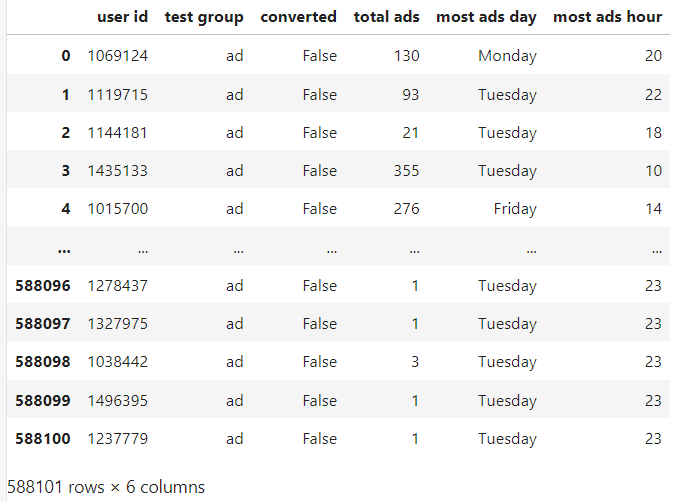
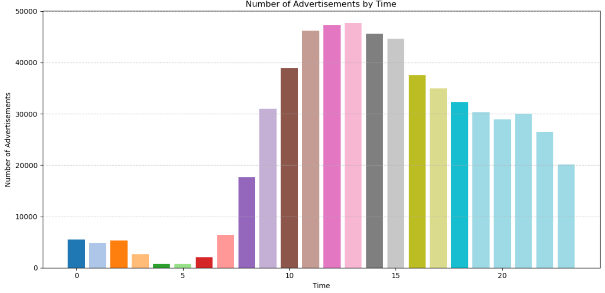
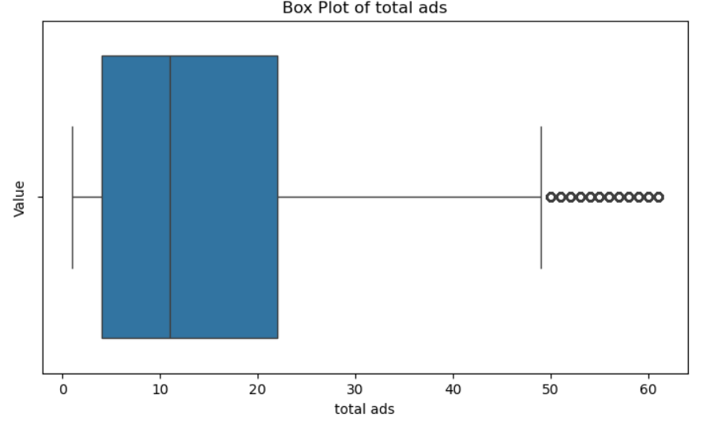
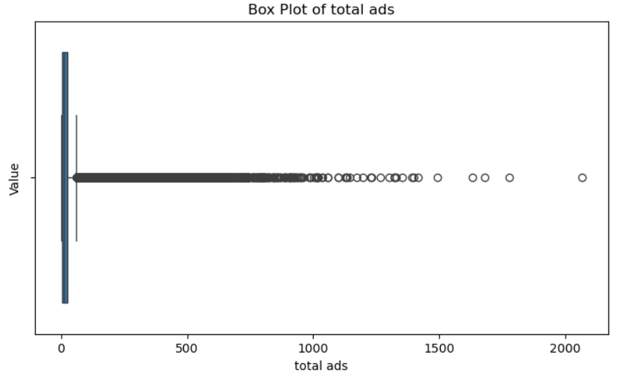
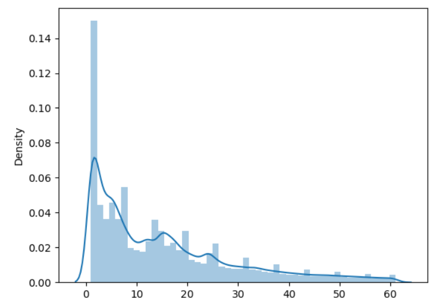
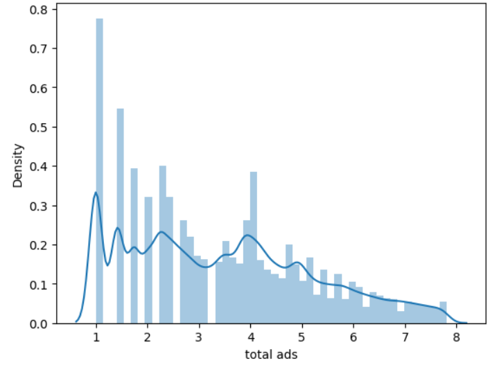
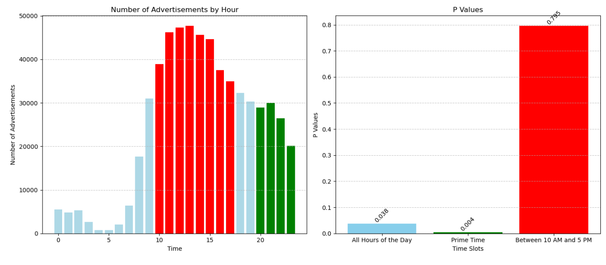

# AB_testing

<table>
  <tr>
    <td><h1> A/B Testing. When You have to make choice  </h1></td>
    <td></td>
  </tr>
</table>

​# Languages, Libraries, Tools & Technologies that I used in this project

    

Imagine you are a company that advertises on television. Your advertising expenses are very high, and you believe some costs need to be reduced. The first thing that comes to mind is: Are the ads really working Should I reduce them, and if so, what should I focus on reducing? Which time slot or hour would be better to cut back on? 
These types of questions have always been on the minds of companies. In this project, I present an analysis that provides answers to these questions.​​

​

# OBJECTIVE

To check whether the advertisements are truly meaningful. 
If a reduction in advertisements is considered, comparing the high-cost prime time slot with other slots and evaluating its importance.

Our hypotheses:
*H0: There is no significant difference between the effects of public service announcements (PSA) and company advertisements (ad).
*H1: There is a significant difference between the effects of public service announcements (PSA) and company advertisements (ad).

 
Tests were conducted with p-values less than 0.05 considered statistically significant.

# Exploratory Data Analysis

* user id: User ID (unique) | * test group: If "ad" the person saw the advertisement, if "psa" they only saw the public service announcement|  * converted: If a person bought the product then True, else is False | * total ads: Amount of ads seen by person | * most ads day: Day that the person saw the biggest amount of ads | * most ads hour: Hour of day that the person saw the biggest amount of ads

​The situation is somewhat different during the hours. Particularly between 10 AM and 4 PM, there is a significant increase in the amount of advertisements, while we observe a plateau during prime time.

<table>
  <tr>
    <td>User ID (unique)</td>
    <td rowspan="6"></td>
  </tr>
  <tr>
    <td>Test Group: If "ad", the person saw the advertisement, if "psa", they only saw the public service announcement</td>
  </tr>
  <tr>
    <td>Converted: If a person bought the product then True, else is False</td>
  </tr>
  <tr>
    <td>Total Ads: Amount of ads seen by person</td>
  </tr>
  <tr>
    <td>Most Ads Day: Day that the person saw the biggest amount of ads</td>
  </tr>
  <tr>
    <td>Most Ads Hour: Hour of day that the person saw the biggest amount of ads</td>
  </tr>
</table>

# Data Wrangling
Removal of outliers

<table>
  <tr>
    <td></td>
    <td></td>
  </tr>
</table>

​​​Above are the box plots of the data distribution before and after the removal of outliers. It is clearly noticeable that many outliers have been removed from the dataset

<table>
  <tr>
    <td></td>
    <td></td>
  </tr>
</table>

​​​​To make the data conform to a normal distribution, the square root transformation technique has been used. As seen, the data normalization process has achieved a nearly symmetric dataset (Skewness = 0.43, Type = Fairly Symmetrical (-0.5 to 0.5): Data distribution is close to symmetrical)

# Determination of Required Sample Size
Using the Proportion Effect Size function, the expected effect size between PSA (0.10) and company advertisements (0.15) has been calculated. Then, using the NormalIndPower class, the required sample size to detect this effect at an 80% power and a 5% significance level has been determined. As a result of the calculations, a total sample size of 681 has been found to be necessary for the analysis.

# Statistical Test
      In light of the obtained data, the z-statistic and p-value were calculated using the proportions_ztest function to evaluate whether the advertisements were successful.​​​​​​​​​

# Conclusion
​​
​ *  When analyzing advertisements between 10 AM and 5 PM, the null hypothesis (H0) is accepted, concluding that there is no significant difference.

 *   When examining the time data between 8 PM and 11 PM (prime time), a high level of significance (0.004) indicates that advertisements create significant changes with high accuracy, leading to the acceptance of the alternative hypothesis (H1).
 *   
Considering these findings, especially when the company is looking to save costs, it can be observed that there is potential for savings from advertisements aired between 10 AM and 5 PM.

